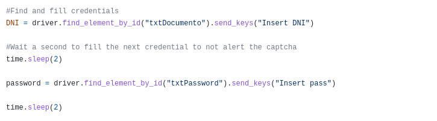
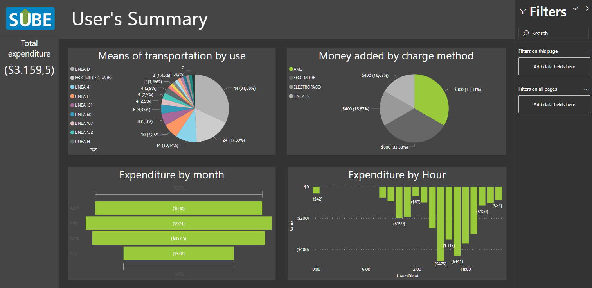

# SUBE personal data scraper and cleaner

A Python scraper that access the SUBE's (Buenos Aires's public transportation system) data of a particular person and then scrapes the information and adds it to an excel file. This file was then used to do some basic analysis and visualizations in PowerBi.

## How it works

The scrape is done using python's Selenium module which opens the browser, fill the credentials and then scrapes the data. It allows a much faster collection of the data than doing it by hand and it is intended to be ran at periodical intervals to track the person's public transport use.

## How to use it

- It is required to have installed geckodriver for Selenium to be able to interact with Firefox, as well as the modules used by the scripts.

   https://github.com/mozilla/geckodriver/releases

- You need a user and password to a linked SUBE card. You can link an existing SUBE card in this link: https://tarjetasube.sube.gob.ar/SubeWeb/Webforms/Account/Views/login.aspx?msg=1

- The credentials have to be replaced in the "SUBE Script.ipynb" file as shown here:

## Power Bi

